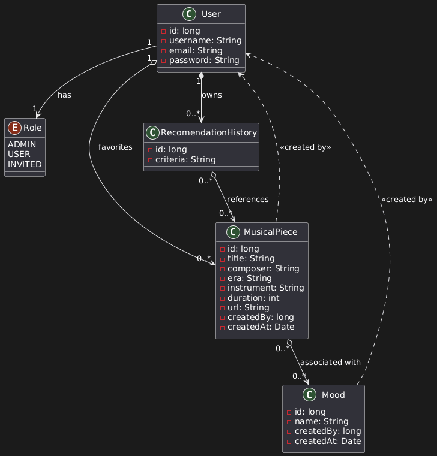

# Music Lover Backend
**Autor:** Luis Miguel Estrada Fernández  
**Tecnologías:** `Java` `Spring Boot` `Spring Data JPA` `Spring Security` `PostgreSQL` `Docker Compose`

---

## Descripción del proyecto

Este proyecto consiste en un **sistema de recomendación musical** especializado en piezas clásicas, desarrollado con **Spring Boot**.  
El objetivo es ofrecer un ejemplo práctico y real del uso de tecnologías modernas de backend basadas en **Java**, integrando seguridad, persistencia y despliegue con contenedores.

---

## Estado del código

---

## 🧠 Arquitectura del proyecto

El sistema se basa en una arquitectura multicapa:
- **Controladores REST** para la comunicación con el cliente.
- **Servicios** que encapsulan la lógica de negocio.
- **Repositorios** gestionados con **Spring Data JPA** sobre **PostgreSQL**.
- **Seguridad** implementada con **Spring Security** (autenticación y autorización por roles).
- **Contenedores Docker** para la orquestación y despliegue mediante **Docker Compose**.

---

## 🗃️ Diagrama de clases

(Agrega aquí tu imagen del diagrama una vez creada)

